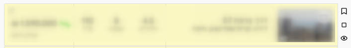

# yad2-flags-userscript
UserScript for [yad2.co.il/realestate](https://www.yad2.co.il/realestate) which adds dedicated flag buttons for search results

Can be installed directly from the [GitHub](https://github.com/yrtimiD/yad2-flags-userscript/raw/main/yad2-flags.user.js) or from the [Greasy Fork](https://greasyfork.org/en/scripts/444053-yad2-flags)
